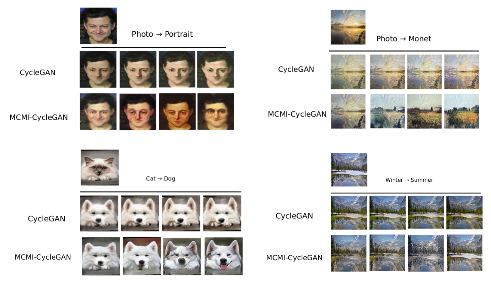

# MCMI: Multi-Cycle Image Translation with Mutual Information Constraints 
[[Project Page]](https://samxuxiang.github.io/mcmi.html)[[Paper]]()

Pytorch implementation of our MCMI image-to-image translation method. Our proposed mutual information constraints
produce higher quality images and learn more semantically-relevant mappings.

## Usage


### Prerequisites
To install all requirements:

```setup
pip install -r requirements.txt
```
- Python 3.7


### Datasets
- cat2dog dataset is already available in ./datasets
- cat2dog: 871 cat (birman) images, 1364 dog (husky, samoyed) images crawled and cropped from Google Images.

## Training

To train the model(s) in the paper, run this command from src folder:
```train
cd src
sh scripts/train_cyclegan.sh
```

This trains a MCMI-CycleGAN model on Cat2Dog dataset and saves the model every 50 epochs. You can train it on other datasets by modifying the dataroot in train_cyclegan.sh
- part of the training code is modified from [official implementation of CycleGAN](https://github.com/junyanz/pytorch-CycleGAN-and-pix2pix)


## Evaluation
- Evaluation code is in the evaluation_cyclegan folder 
- Move trained MCMI-CycleGAN model to checkpoints/chat2dog_cyclegan folder for evaluation
- To evaluate the trained model for FID1, FID2 and LPIPS scores as described in the paper, run this command from evaluation_cyclegan folder:
```eval
cd evaluation_cyclegan
sh test_drit.sh
```
The evaluation code will look for model trained at epoch 200 under /evaluation_cyclegan/checkpoints/cat2dog_cyclegan folder. You need to change "all_files" in line 70 of text.py to evaluate at your own model epoch. 
- It can take some time to download and load inception and alexnet weights 
- We use the correct pytorch FID implementation from here: https://github.com/mseitzer/pytorch-fid

## Results

Our pre-trained model achieves the following performance on cat2dog dataset. You can download it from here: https://drive.google.com/file/d/1AXBwxl8MaWEiSl3etNX5f_yMYIKdQiTK/view?usp=sharing 

### 

| FID1         | FID2  | LPIPS |
| ------------------ |---------------- | -------------- |
| 62.85   |     28.09         |      0.22       |


